## 📣 대학교 졸업작품 - 아동 상담을 위한  AI기반 컬러링 도안 생성 웹서비스 
  

# 📖 프로젝트 개요
##  프로젝트 소개 
아동 상담을 위한 수단으로 아동의 흥미를 유발하는 사진을 웹 스크래핑으로 검색하거나 직접 선택하여 이미지 생성 모델로 도안을 생성하고, 이미지 전처리 후 인쇄하는 웹 사이트입니다.

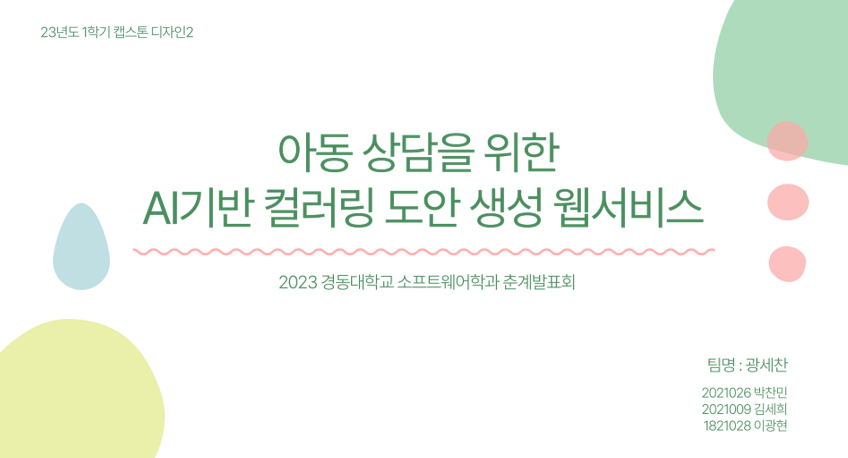
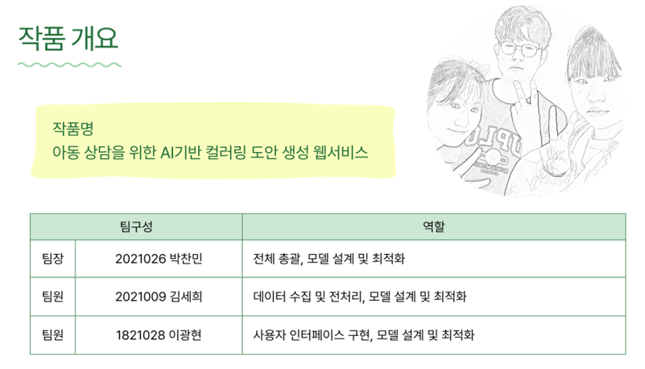

---
##  프로젝트 기간
 🕛2023.3.4 - 2023.6.15

## 작품 개발 동기 및 목표
### 개발동기
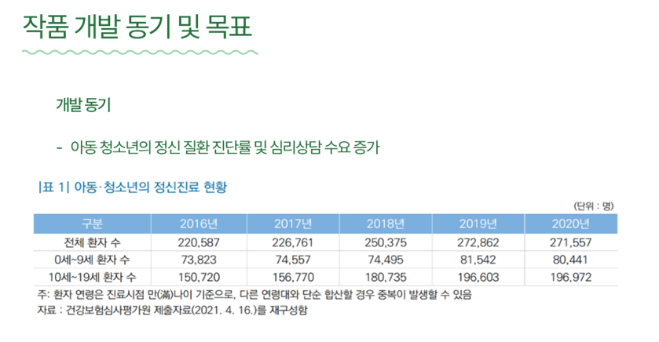

<ul>
    <li>아동심리상담 과정 중 컬러링 활동애는 아동의 눈높이에 맞지 않은 요소가 많음</li>
    <li>평소 관심분야인 인공지능과 접목시켜 아동의 질의응답을 바탕으로 맞춤형 컬러링 도안을
        제작 및 추천하는 서비스를 고안</li>
</ul>

### 개발목표

<ul>
    <li>기술적 목표 </li>
        <ul>
            <li>
                사용자가 제시한 특정 키워드를 바탕으로 수집된 이미지를 인공지능 모델을 통해 백지에 검은 실선으로 이루어진 컬러링 도안을 제작 및 출력하는 서비스를 개발기술적 목표
            </li>
        </ul>
    <li>사회적 목표 </li>
        <ul>
            <li>
                아동과 상담가 사이의 친밀감 형성을 고취시켜 상담의 질을 높이고 상담비용 감소 효과
            </li>
        </ul>
</ul>

## 작품의 창의성
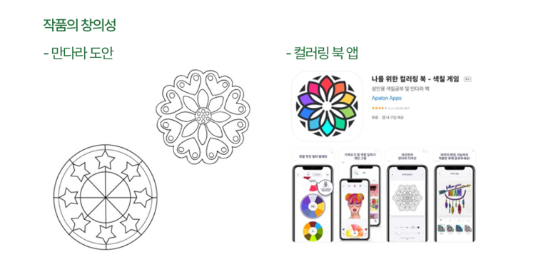

## 작품 개발 목표 및 설계요건

<ul>
    <li>설계목표 </li>
        <ul>
            <li>
                아동 상담을 위한 AI기반 컬러링 도안 생성 웹서비스
            </li>
        </ul>
    <li>설계 요구사항</li>
        <ul>
            <li>아동의 연령에 맞도록 난이도 설정해야한다.</li>
            <li>찾고자 하는 이미지를 정확하게 크롤링을 하는 신뢰성이 요구된다.</li>
            <li>이미지를 도안으로 깔끔하게 변환하기 위한 모델 설계가 필요하다.</li>
        </ul>
    <li>설계에 따른 현실적 제약 요소</li>
        <ul>
            <li>
                화질이 좋지 않거나 픽셀이 너무 작은 사진은 출력시 화질이 좋지 않을 수 있다.
            </li>
        </ul>
</ul>

---
## 📚 개발환경
 
- 

- 
- 
- 
-     
-    

---
### 시스템 프로세스

왼쪽상단에 Offline부터 시작하여  
Text-to-images->image-to-ColoringPages->Web->다시 Offline으로 가는 순서입니다.  
앞에서 말했듯이 아이한테서 키워드를 얻어 검색을 하면 이미지 크롤링을 수행하고
N개의 이미지를 데이터베이스에 저장합니다.   
이때 N은 우리가 설정한 적합한 이미지 개수로, 현재는 6개로 설정되어 있습니다.  
 그 후, 아이는 이 중에서 관심 있는 그림을 선택하면 해당 이미지를 여러 단계의 변환 과정을 거쳐 최종적으로 도안으로 된 이미지를 받아서 저장하고 출력할 수 있습니다.

---
## 🔭 나의 구현 기능
🔥 데이터베이스 설계 🔥
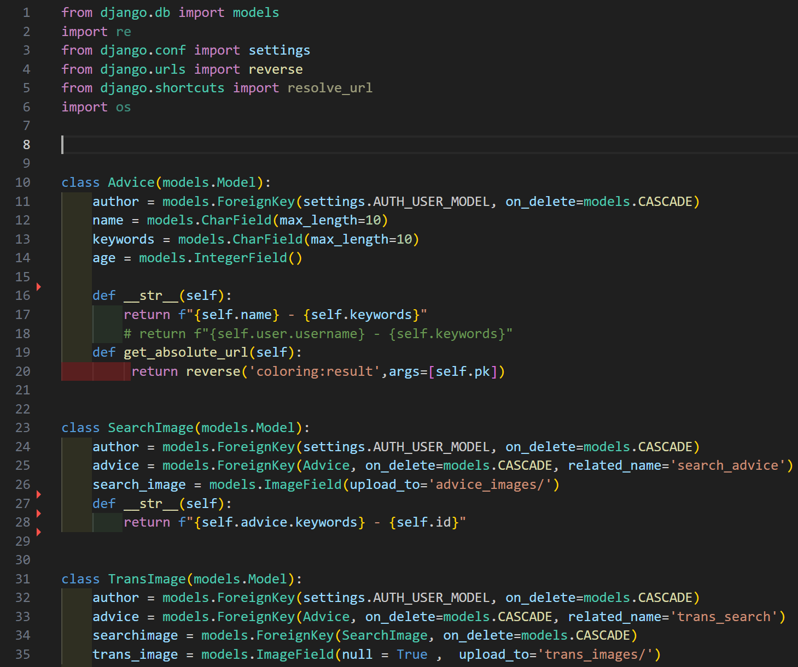

🔥 이미지 업로드 과정 🔥  
변환할 이미지를 업로드하는 방법은 두가지가 있습니다.

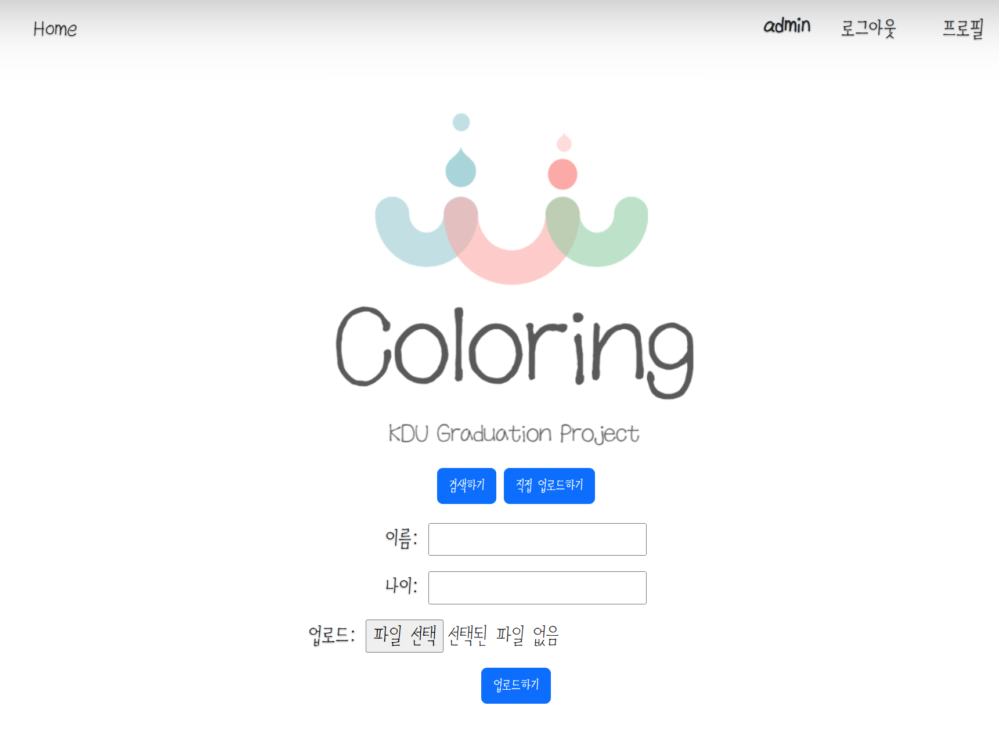
첫번째는 직접 업로드 하는 방식이 존재하고 

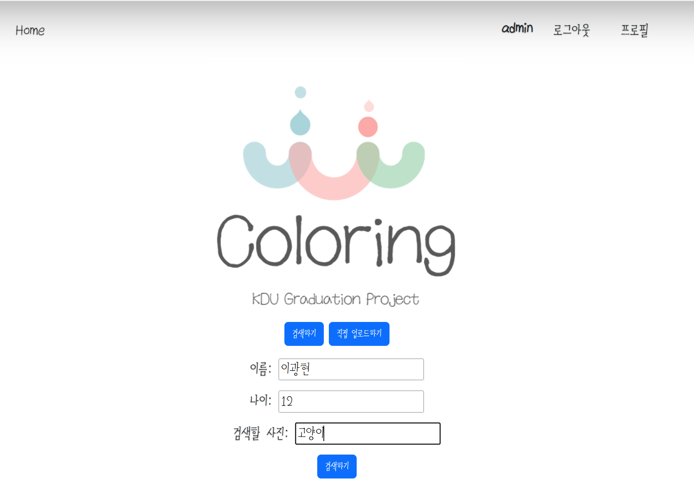
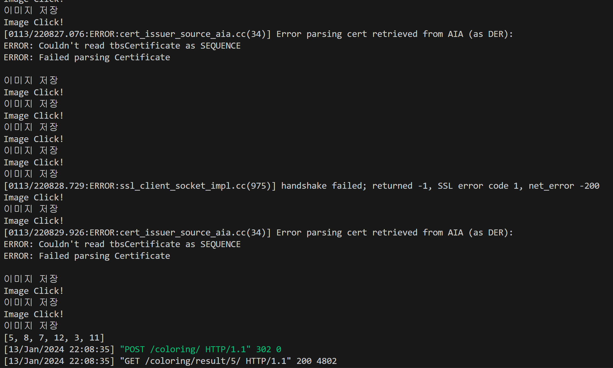
두번재는 스크래핑(셀레니움)을 사용하여 이미지를 검색후에 원하는 이미지를 선택하는 경우 입니다.

먼저 상담받을 아이의 이름과 나이를 입력하고 원하는 이미지 키워드를 검색하면  
셀레니움을 이용해 동적으로 고양이를 검색해 일정 개수의 이미지만큼 다운로드 하고
검색을 할 떄마다 다른 결과가 나올 수 있게 그 안에서 랜덤으로 추출하여 저장하는 방식입니다.

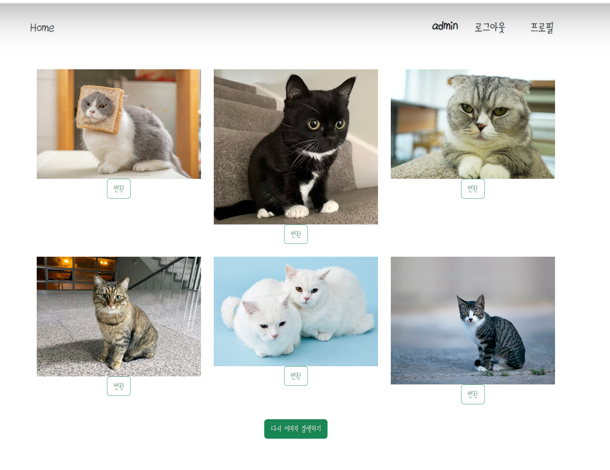
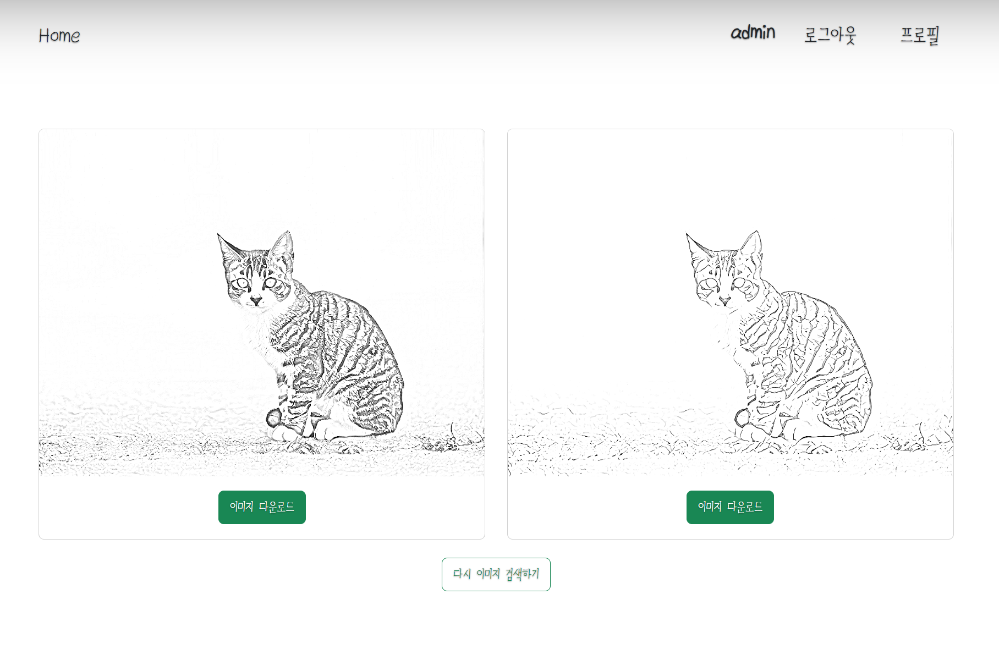
검색이 완료되면 6개의 이미지가 화면에 나와지고 이 중에서 원하는 이미지를 선택하여 변환합니다.

---
🔥 이미지 변환 (images-toColoringpages 상세 과정 ) 🔥

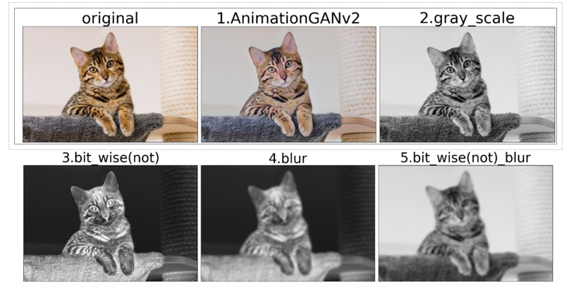 

위 사진은 시스템 프로세스에서 확인한 이미지 변환 과정으로(image-to-ColoringPages부분), 이미지를 스케치 형태로 변환하는 코드입니다.

1. 원본 이미지를 딥러닝 모델인 AnimeGANv2에 입력하여 애니메이션 스럽게 변환합니다.
2. 변환된 이미지를 BGR 색 공간에서 흑백(그레이 스케일)으로 변환합니다.
3. 흑백 이미지에 비트별 부정 연산을 수행하여 이미지를 반전시킵니다.
4. 반전된 이미지에 가우시안 블러를 적용하여 이미지를 흐리게 만듭니다. 이는 스케치 효과를 부각시키는 데 도움이 됩니다.
5. 블러 처리된 이미지에 다시 비트별 부정 연산을 수행하여 이미지를 다시 반전시킵니다.
6. 최종적으로 흑백 이미지를 반전된 블러 처리된 이미지로 나누어, (스케일링을 수행하여) 스케치 이미지의 결과값을 얻습니다.

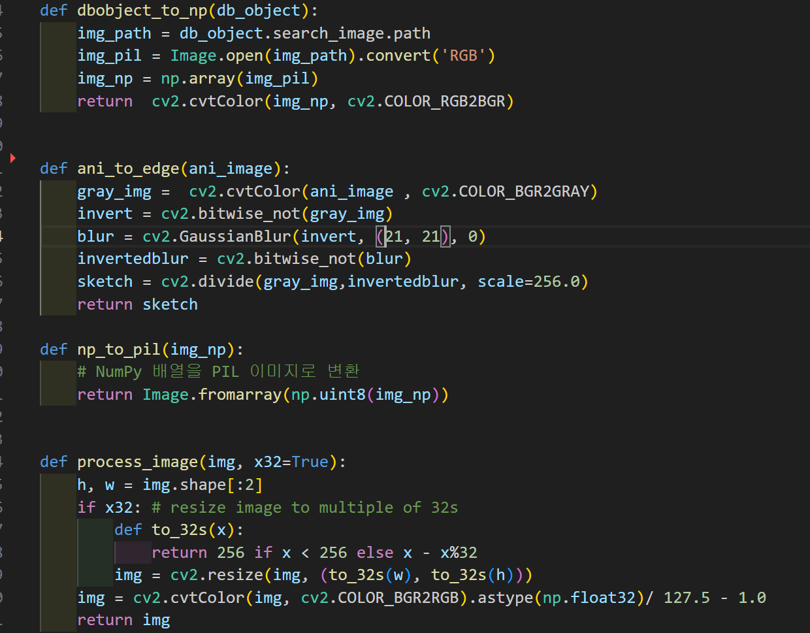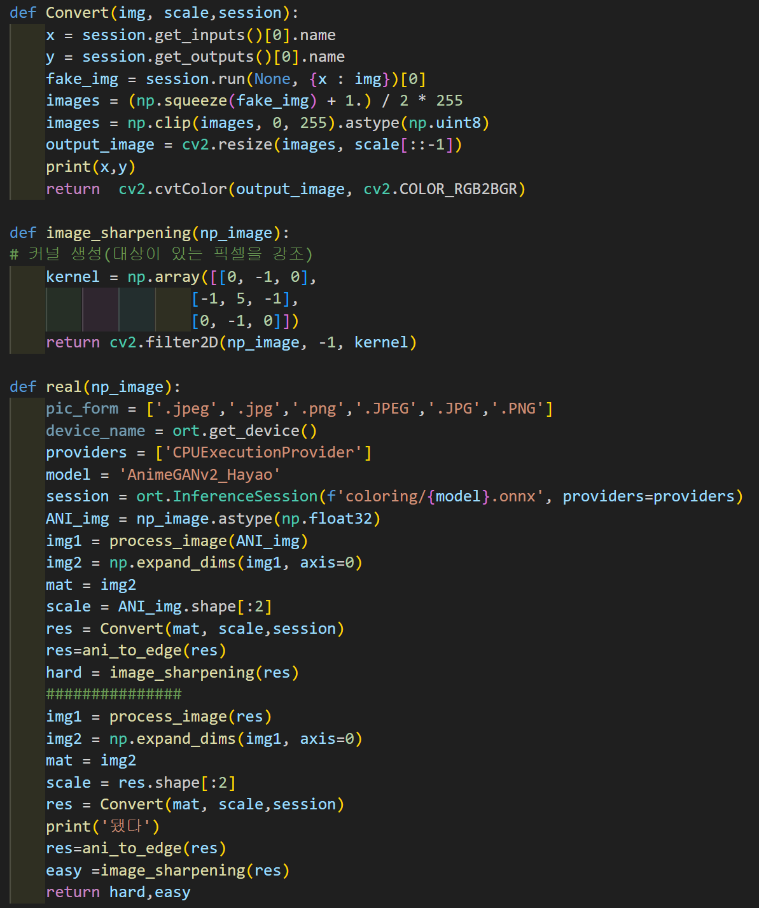

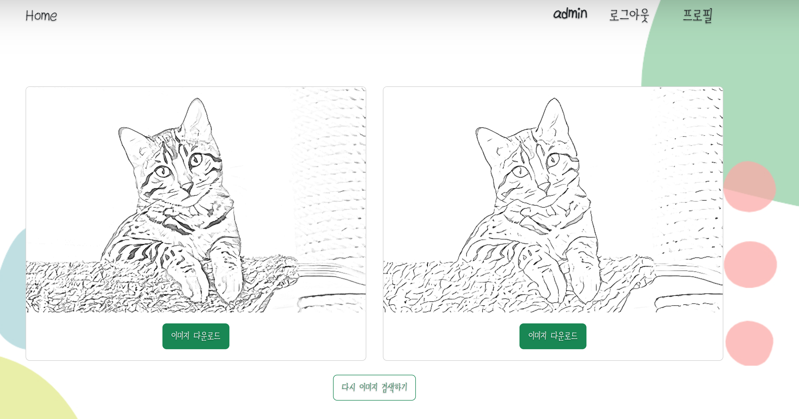 
최종 결과물은 스케치의 정도가 다른 두 개의 사진으로 나오며, 아이가 좀 더 그리기 편하거나 선호하는 스타일을 선택할 수 있습니다.

#### AnimeGANv2란❓
 Anime 스타일의 이미지를 생성하기 위한 딥러닝 모델 중 하나로 알려져 있습니다. 이 모델은 GAN(Generative Adversarial Network)의 한 종류로서, 특히 애니메이션 스타일의 이미지를 생성하는 데 특화되어 있습니다.  
https://github.com/TachibanaYoshino/AnimeGANv2 - 참고자료

#### GAN이란❓
GAN은 두 개의 신경망, 생성자(generator)와 판별자(discriminator),이 서로 경쟁하면서 학습하는 모델입니다.

• 생성자(generator): 생성자는 무작위로 생성된 잡음을 입력으로 받아 가짜 데이터(예: 이미지)를 만듭니다. 목표는 실제 데이터와 비슷한 가짜 데이터를 생성하는 것입니다.  
• 판별자(discriminator): 판별자는 생성자로부터 생성된 가짜 데이터와 실제 데이터를 구분하는 역할을 합니다. 목표는 생성자로부터 생성된 가짜 데이터와 실제 데이터를 구분해내는 것입니다.

GAN은 생성자와 판별자가 서로를 배우고 개선시키는 과정을 거치면서 학습됩니다. 생성자는 점차적으로 더 진짜 같은 가짜 데이터를 생성하도록 발전하고, 판별자는 점차적으로 더 정확하게 가짜와 실제 데이터를 구분하도록 학습됩니다. 이 과정에서 생성자와 판별자는 서로를 견제하고 발전시키는 경쟁 관계를 형성합니다.

간단히 말하자면, GAN은 생성자와 판별자라는 두 개의 신경망이 경쟁하면서 학습하는 모델로, 실제와 비슷한 가짜 데이터를 생성하고 구분하는 능력을 가지고 있습니다. 이를 통해 이미지 생성과 변환 등의 다양한 응용 분야에서 활용할 수 있습니다.

--- 
## 📌 프로젝트 회고 
 이 프로젝트는 처음 진행한 프로젝트로 많은 시행착오가 있었습니다.  
 졸업작품 당시 데이터베이스의 중요성 인지가 미흡한 상태로 개발하여 개발 도중 데이터베이스 설계가 제대로 갖춰지지 않아 일관성에 위배 되는 문제가 발생하였습니다.   
 결국 다시 정규화하여 개발해야 하는 번거로움으로 일정에도 영향을 주었습니다. 이를 통해 초기에 데이터베이스 설계가 단순히 테이블과의 관계에 그치지 않고, 무결성, 정규화, 성능 최적화 등을 종합적으로 고려해야 한다는 중요성을 깨달았습니다.